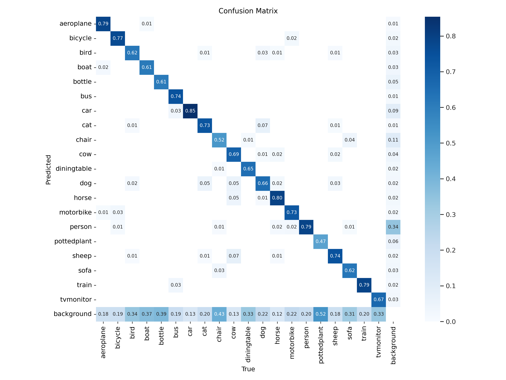
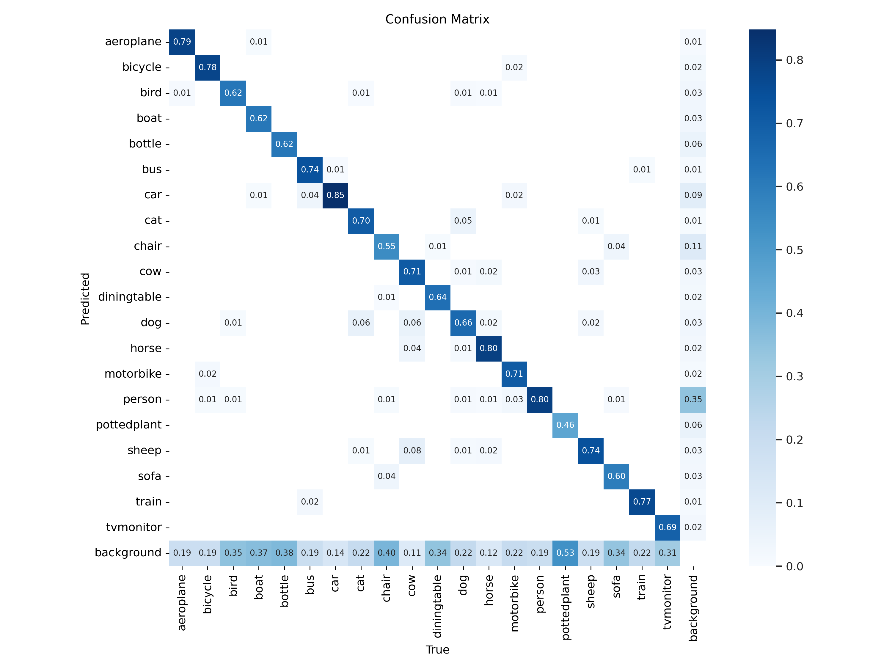
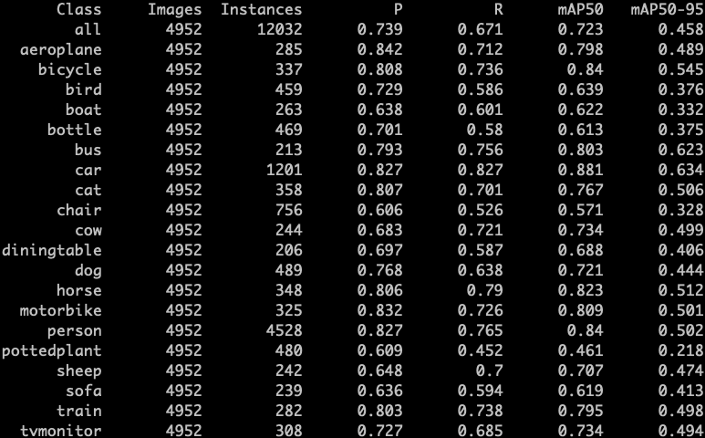
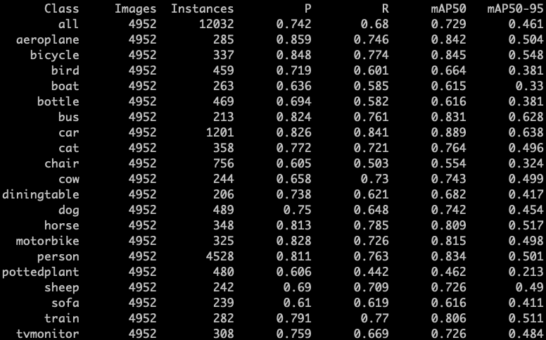
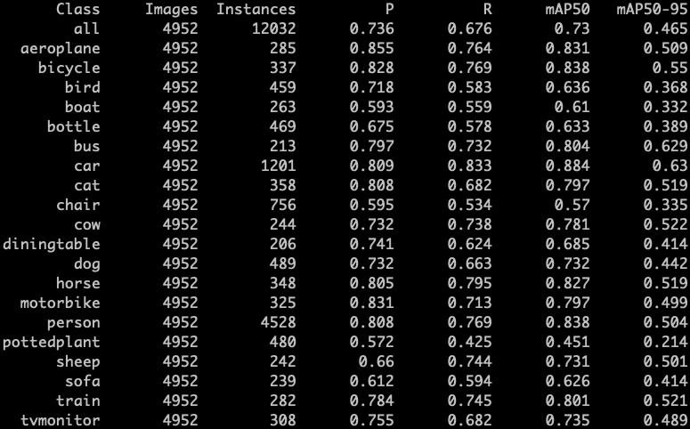

# Object Detection Loss comparison

Some work to compare various object detection loss functions

## Confusion Matrix

GIou             |  DIoU |                                  CIoU
:-------------------------:|:-------------------------:|:-------------------------:
  |   | 

## mAP50-95 (on VOC test dataset)

GIou             |  DIoU |                                  CIoU
:-------------------------:|:-------------------------:|:-------------------------:
0.458  |  0.461 | 0.465

## Validation Summary (using best.pt)

GIou             |  DIoU |                                  CIoU
:-------------------------:|:-------------------------:|:-------------------------:
  |   | 

## Training time (in hours)

GPU - 1080Ti

GIou             |  DIoU |                                  CIoU
:-------------------------:|:-------------------------:|:-------------------------:
13.802   |  13.639 | 14.384 
